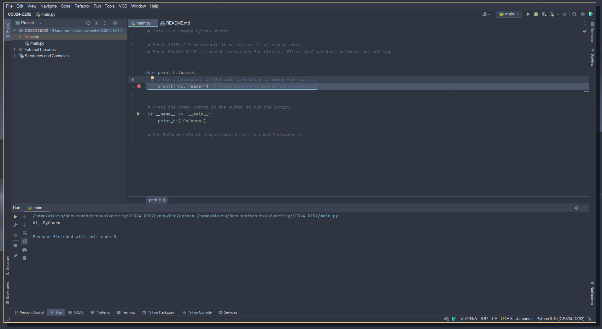

# CS324-DZ02

### 1. 


Instaliran pycharm, i pokrenut projekat

### 2. 

```python
def is_prime(num):
    if num >= 1:
        for i in range(2, num):
            if num % i == 0:
                return False

        return True


def main():
    for n in range(200):
        if is_prime(n):
            print(n)


if __name__ == '__main__':
    main()
```

Štampanje svih prostih brojeva u opsegu 200