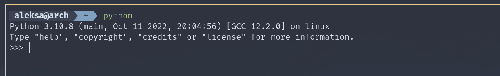

# CS324 - DZ01



Python:
```python
    from math import log2, ceil, floor

    num = int(input("Enter a number"))

    print("Number is power of 2" if ceil(log2(num)) == floor(log2(num)) else "Number is not a power of 2")
```

C:
```c
#include <stdio.h>
#include <math.h>

int main() {
    int n;

    printf("Enter a number: ");
    scanf("%d", &n);

    printf((ceil(log2(n)) == floor(log2(n))) ? "Input number is a power of 2\n" : "Input number is not a power of 2\n");

    return 0;
}

```

## Opis ova dva slucaja:
Glavna razlika je u sintaksi. Python je dosta sličan jeziku čoveka, nije striktan kao što je C, i ne zahteva
od programera da se pridržava strategiji za učitavanje biblioteka kao što zahteva programski jezik C. 
Ono što je pisano u C-u, u pythonu je napisano u 3 linije koda. Pored toga, glavna logika je slična.

