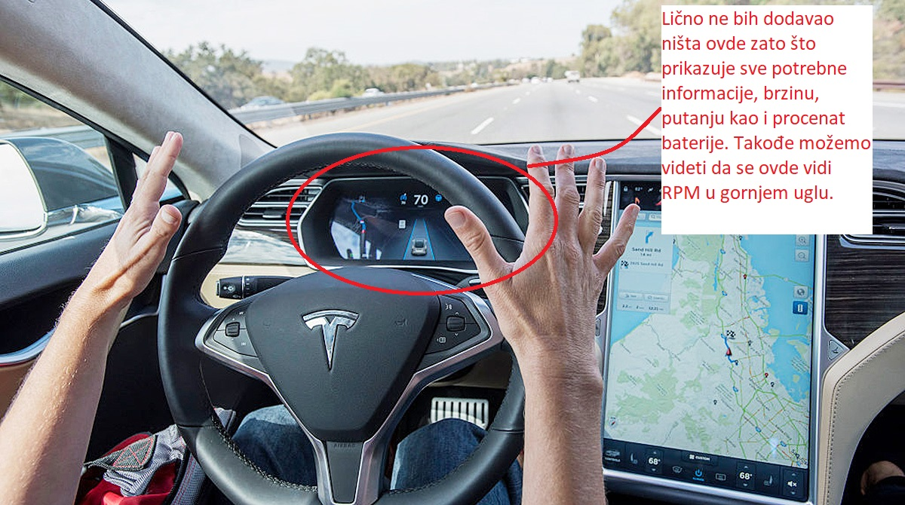

# Zadatak 1

Analiza sistema za navigaciju.

## Google Maps

Sistem koji sam ja koristio pri vožnji za navigaciju je GPS baziran na Google Maps. Sistem treba da osigura sigurnost
pri vožnji, što znači da ne ometa vozaču tokom vožnje. Postoje razni sistemi za navigaciju koji se sve vrše usavršavaju,
ali koji mogu i da rade na glasovnim odgovorima. Ti sistemi po meni nisu dobro dizajnirani zato što mogu da ometaju
vozača pri vožnji.

Pitanje | Odgovor 1 | Odgovor 2 | Odgovor 3 |
------ | --------- | --------- | --------- |
Da li vam se sviđa ovaj sistem i ukoliko ne koji je po vama najbolji sistem za navigaciju? |  Sistem je dobro osmišljen ali nije dostupan svakom.  | Okej je zamisao ali ima puno mana.  | Nije praktičan za sve korisnike. Postoje mnogo bolji sistemi što se tiče toga. Na primer Teslin Model 3 ima dosta dobar sistem. | 
Koje su prednosti i nedostaci ovog sistema? | Prednosti su to što može da se namešta glasovna navigacija, kao i to što je napravljen da ne ometa vozača. Nedostaci su to što mora biti povezan na internet.  | Prednosti: Svako ko ima internet može koristiti i prilagoditi svom korišćenju. | Prednosti su to što može se podešavati ali naveći nedostatak je što je potreban internet. |
Da li ima potrebe uključiti glasovnu navigaciju u sistemu? | U mojem slučaju da, trebam znati kada i koliko sam blizu destinacije. | To je do vozača, ali moj odgovor je da. | Da. |
Da li po vama glas treba da bude muški ili ženski? | Ženski. | Ženski. | Muški. |
Ocenite sistem na skali od 1 do 10 | 8.5 | 7.0 | 6.0, možda manje |

## Prikaz u vožnji.

# Analiza

Vidimo da većina korisnika misli da je ovaj sistem dobro osmišljen ali da nije dostupan svim korisnicima zbog pristupa internetu.
Kao što možemo da vidimo prednosti ovog sistema jeste to što se može podesiti korisnicima kako im odgovara ali da ima jednu veliku manu a to je dostupnost internetu.
Svi su korisnici su rekli da treba glas biti uključen prilikom korišćenja navigacionog sistema radi lakše navigabilnosti.
Većina korisnika preferira ženski glas nego muški.
Ocene sistema nisu najbolje ali su na sredini, variraju od najveće ocene koja je 8.5 do 6.0 koja je najmanja.
